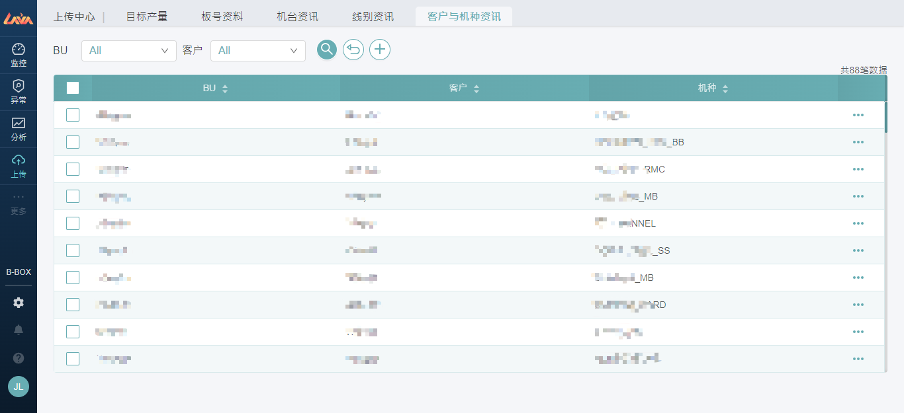

# 4 【上传】板块 - 上传中心

💡 业务描述：用户进入此模块，可以进行相关**资料的维护设定**。

💡 功能目的：用户可以维护监控、分析、异常等模块会使用到的数据，包含**目标产出**、**板号资料**、**机台资讯**、**线别资讯**、**客户与机种资讯**。

💡 操作要点：点选导览列【**上传**】板块

## 4.1 目标产量

### 4.1.1 新增资料

点击+，可以新增机种并设定基础资料。

温馨提醒：机种、客户下拉清单数据来自【客户与机种资讯】；线别下拉清单数据来自【线别资讯】；站别下拉清单为固定。

### 4.1.2 编辑资料

点击右侧●●●编辑，可以调整指标的设定值，包含标准CT、设备数量、生产效率、YR、Retest Rate、Retry Rate与其阈值。

### 4.1.3 查看资料

#### 4.1.3.1 机种线别时间有效产出-资料显示

点击上一页右侧●●●查看，可进入此页面查看初始设定试算的机种线别每小时产出。

#### 4.1.3.2 机种线别时间有效产出-编辑指定线别

点击右侧●●●编辑，可设定每小时可用时间并计算有效产出，弹性设定白晚班的目标产出，最后记得点选上方**储存，**才能保存设定的数据。

- 点击上方**时间套用**，一键套用到每小时，只要调整特定小时即可。
- 点击上方**时间试算**，一键试算每小时产出以及24小时合并总有效产出。

温馨提醒：目标产出 = (每小时可用时间 / 标准CT ) X 生产效率 X 设备数量。

#### 4.1.3.3 机种线别时间有效产出-新增线别

点击上方+，可以新增机种生产线别，并设定有效产出。

## 4.2 板号资料

### 4.2.1 编辑资料

板号-机种组合资料自动从Log产生，点击右侧●●●编辑，可以刷新确认是否有解析的Gerber和电路图，并选择其中一个；如果没有的话，请先到页面上方上传按钮跳转到AIoT实验室完成图档解析和电路图新增，再回来完成后续流程。

### 4.2.2 上传资料

请点选页面上方的**上传按钮**，系统跳转到AIoT实验室的网页，按照如下操作分别进行**Gerber图档**和**电路图**上传。

- ① Gerber数位化：从右侧导览列进入此页面。
- ② 输入板号：输入PCB NO，点击 **数位化按钮** 完成新增。

## 4.3 机台资讯

### 4.3.1 新增资料

点击上方+，可以机台资讯，管理机台清单。

温馨提醒：设备类别、厂商、型号、进厂方式、区域下拉清单数据为【默认】，暂时无法修改。

## 4.4 线别资讯

### 4.4.1 新增资料

点击上方+，可以新增线别所属厂别，区域。

温馨提醒：【监控】、【分析】板块，均会用到这个对应表；厂别和区域下拉清单数据为【默认】，暂时无法修改，线别下拉清单数据源自【Log】

## 4.5 客户与机种资讯

### 4.5.1 新增资料

点击上方+，可以新增机种所属BU，客户。

温馨提醒：【监控】、【分析】板块，均会用到这个对应表；BU和客户下拉清单数据为【默认】，暂时无法修改，机种下拉清单数据源自【Log】。

