# 3 【分析】板块 - 测试结果分析

💡 业务描述：用户进入此模块，可以进行站别【测试指标】的监控。

💡 功能目的：用户可以实时监控生产测试情况，包含产出(Ouput)、良率(YR)、重测率(Retry Rate、Retest Rate)、机台利用率等指标趋势。

💡 操作要点：点选导览列【监控】板块，选择【站别】页面

## 3.1 测试总览

### 3.1.1 客户、产线、机种分布情况

根据页面的客户、线别、机种、时间（可精准到日）等筛选条件，显示Retry、Retest Rate指标分布。此外，图例可自由开启关闭显示。

温馨提醒：筛选条件内容来自【上传中心】，所以要记得维护想看到的客户、线别、机种讯息，才能看到。

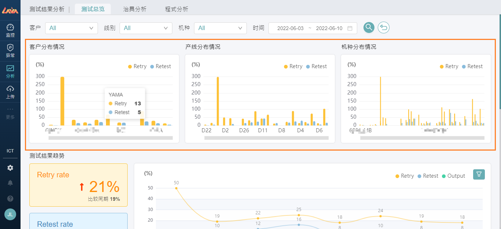

### 3.1.2 测试结果趋势

根据上面筛选条件，显示指标根据时间趋势的变化。进阶筛选按钮可以根据日、周、月进行聚合计算，或选出Output大于指定条件显示于图表。

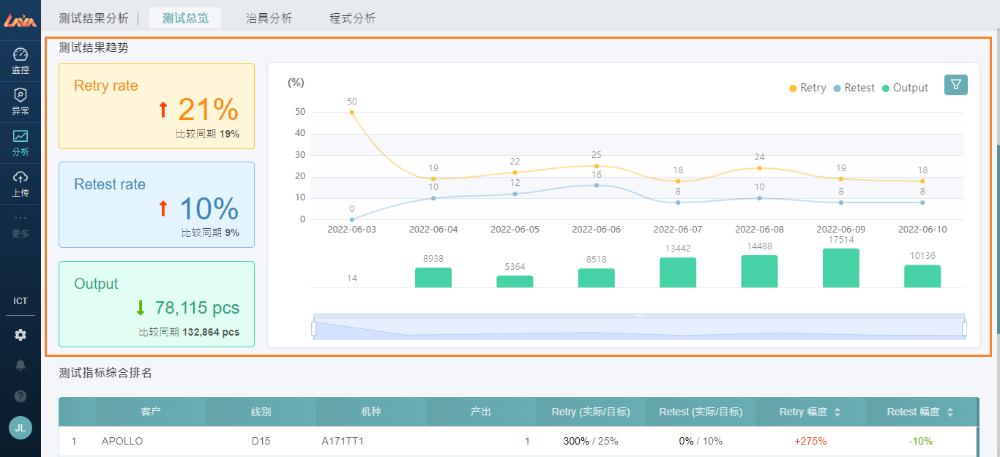

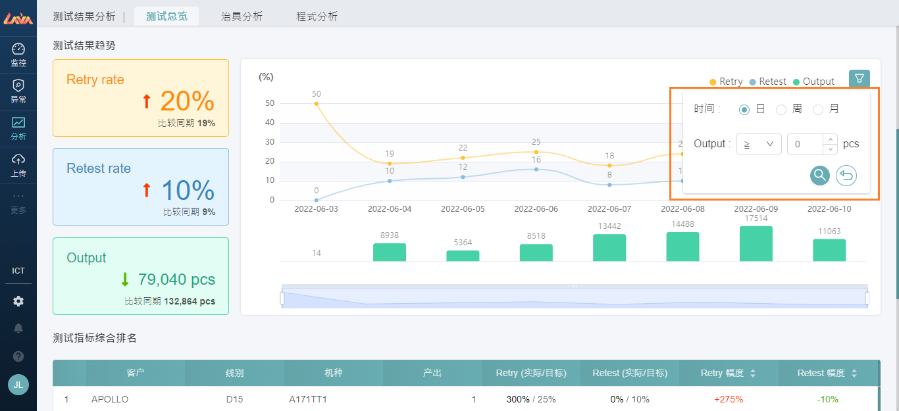

### 3.1.3 测试指标综合排名

按照上面筛选条件，默认根据Retry幅度变化有大到小排序。

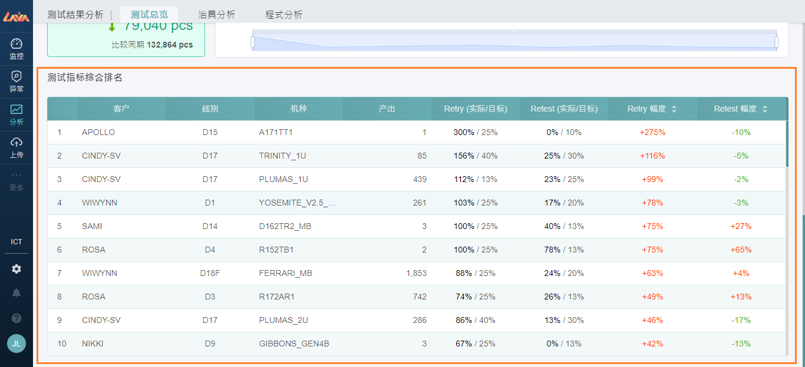

## 3.2 治具分析

### 3.2.1 页面介绍

页面首次进入会默认一个机种显示，如果要选择其他机种，则请先点选重置在进行下拉选取。

温馨提醒：机种、线别、治具，自动从【上传中心-目标产量】、Log数据 计算得出的组合。

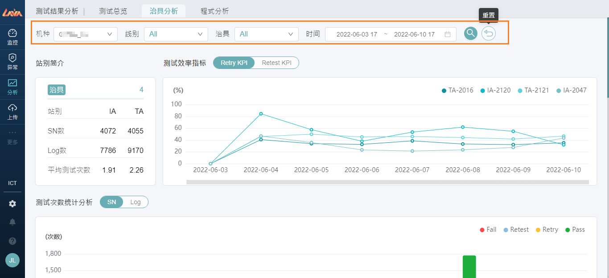

### 3.2.2 站别简介

此图表显示治具站别的基础统计结果，包含治具个数、分站别（IA、TA）统计的SN数量、Log数量、平均测试次数（Log数量/SN数）。

点选“治具”按钮，弹窗显示治具详情指标计数结果。

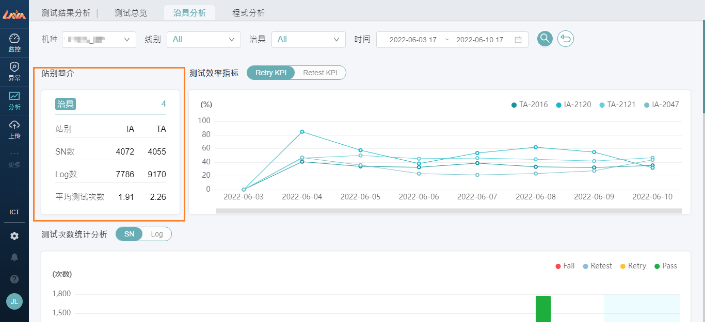

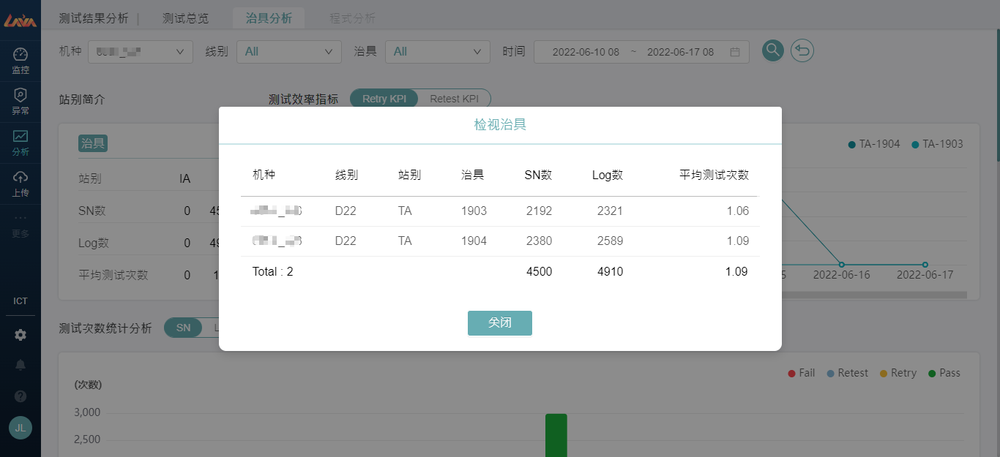

### 3.2.3 测试效率指标

此图表显示Retry Rate、Retest Rate的是每日趋势图；上面切换钮可以自由切换KPI。

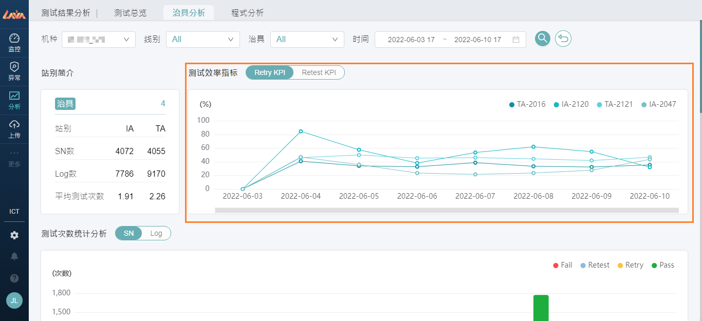

### 3.2.4 测试次数统计分析

此图表显示每日Log类型的计数，计数模式可以由上方切换钮选择SN或者Log；Tooltip会显示不同治具计算的结果。

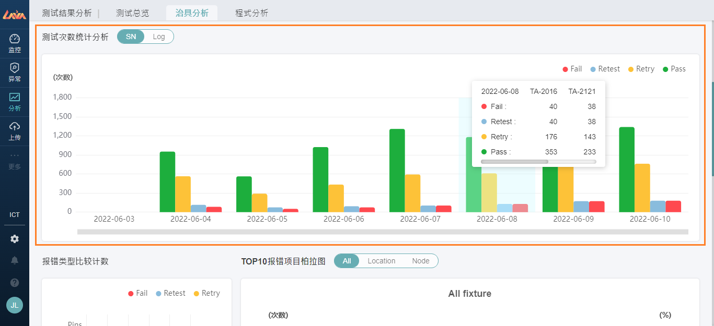

### 3.2.5 报错类型比较计数、Top10报错项目柏拉图（仅ICT）

图表显示报错类型七大报错计数；右方呈现Top10的柏拉图，上面筛选条件可以选择采用那个分类计算，图表左右可滑动查看不同治具的分布情况。

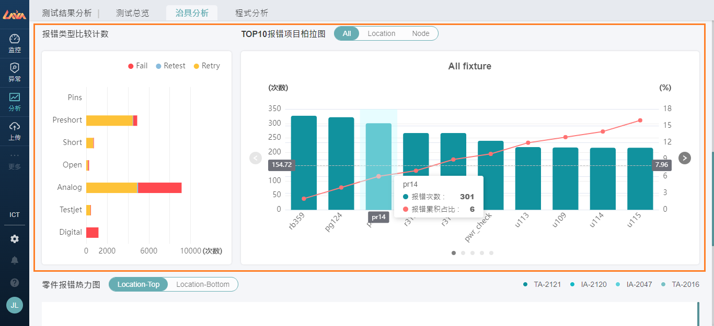

### 3.2.6 零件报错热力图（仅ICT）

Gerber图档显示不同治具报错的零件热力图，查看集中区域。

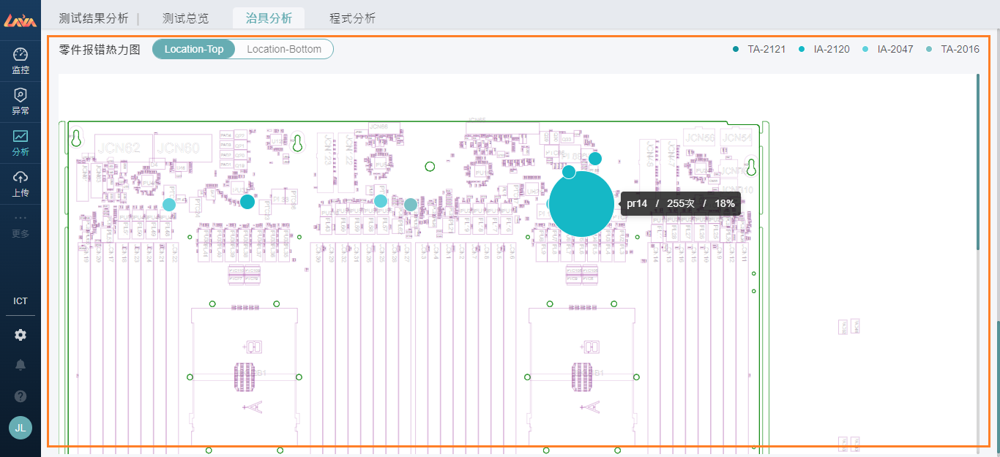