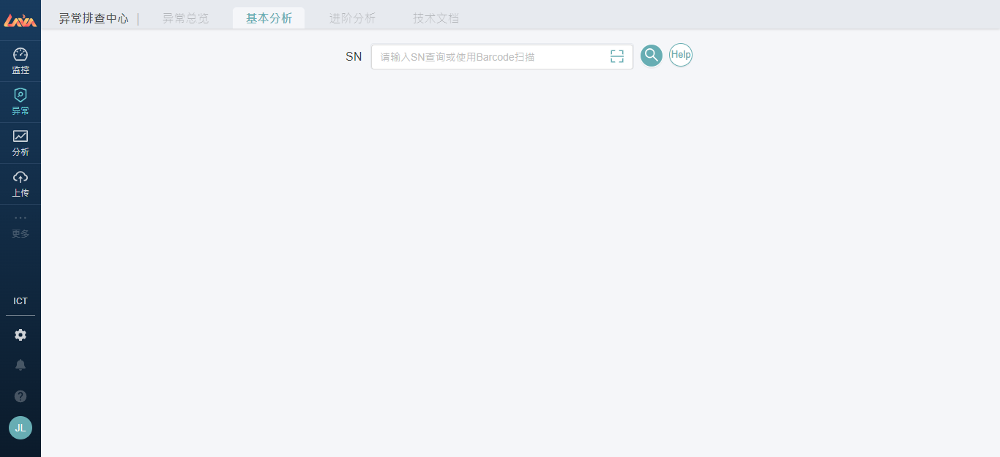
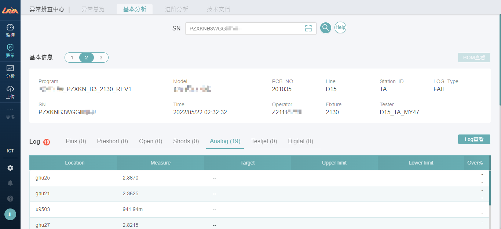
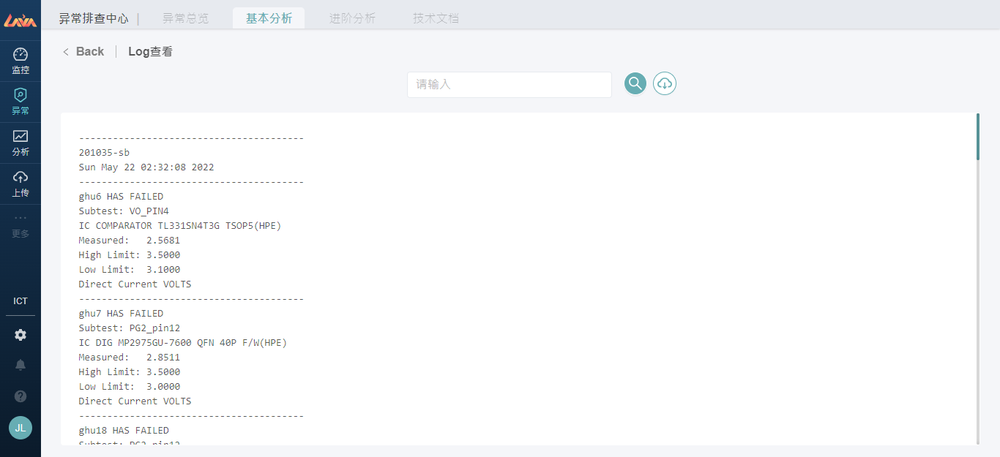
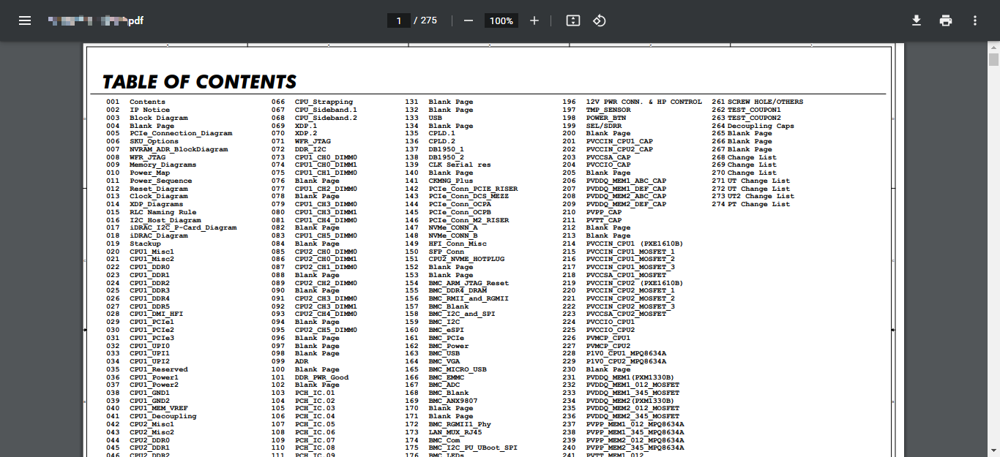

# 2 【异常】板块 - 异常排查中心

💡 业务描述：用户进入此模块，可以进行异常排查。

💡 功能目的：用户快速排查问题点，包含**异常总览（开发中）、基本分析**等模块

💡 操作要点：点选导览列【异常】板块

## 2.1 基本分析

### 2.1.1 SN查询

输入SN，可以带出板子的测试Log资料，包含如下：

- 基本信息：测试log基础资料。
- Log：Log报错解析结果。
- Gerber：显示报错位置，目前仅支援component的Top、Botton图层显示。

### 2.1.2 Log查看

进阶查询原始Log。

### 2.1.3 Gerber查看

进阶查询零件位置，放大缩小Gerber档。

### 2.1.4 电路图查看

进阶查询相关的电路图PDF。

