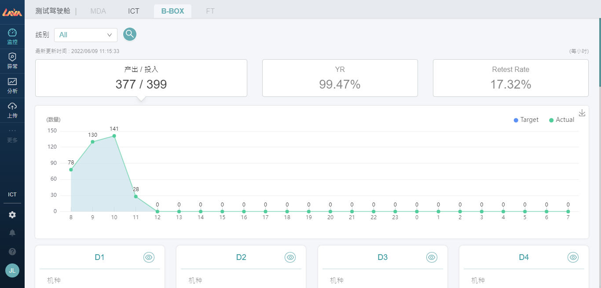
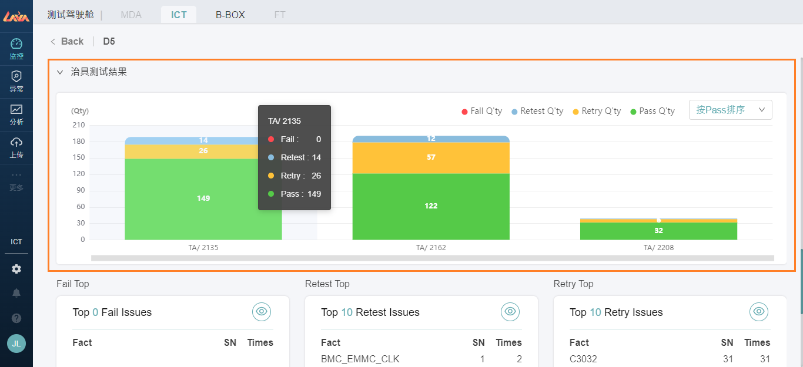
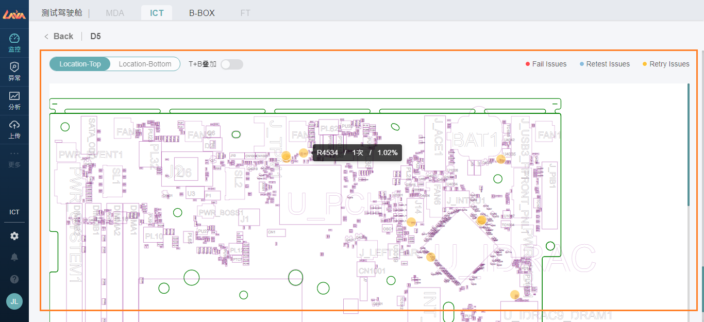

# 1.【监控】板块 - 测试驾驶舱

💡业务描述：用户进入此模块，可以进行站别【测试指标】的监控。

💡功能目的：用户可以实时监控生产测试情况，包含产出(Ouput)、良率(YR)、重测率(Retry Rate、Retest Rate)、机台利用率等指标趋势。

💡操作要点：点选导览列【监控】板块，选择【站别】页面

## 1.1整体指标监控看板

- 此模块目前仅上【ICT】、【BBOX】两个站别的模块，两者差异在于BBOX没有Retry Rate和机台利用率指标。

图1: ICT监控页面

图2: BBOX监控页面

### 1.1.1 指标介绍

- 产出/投入（Ouput/Input）：
    - 产出：Log上抛结果为TA站别且为结果为PASS的条件下，计算SN数量
    - 投入：Log上抛结果为TA站别的条件下，计算SN数量

- 良率（YR）：
    - 良率：Log上抛结果为TA，计算1- (Fail Qty/Input Qty)

- 重试率（Retry Rate）：
    - Retry Rate：Log上抛结果为TA，计算(Retry次数-Fail的Retry次数)/Input数量[(Retest+pass+ng)-(ng的Retest)]

- 重测率（Retest Rate）：
    - Retest Rate：Log上抛结果为TA，计算Retest次數/ Input数量(Retest+Pass+Fail)

- 机台利用率（Equip. Utility Rate）：
    - Utility Rate：上传中心维护的机台资讯，计算数量得出。

### 1.1.2 趋势图显示

趋势图时间从当天早上8点到隔天早上8点，记录24小时白晚班的指标。
例如：8点的数值是计算从08:00:00-08:59:59合计。

## 1.2 线别指标监控看板

线别卡片显示当天生产的机种、指标等资讯，并搭配指标的目标值显示预警灯号。

如果单天生产多机种，则预警灯号条件采用产量加权计算得出；此外，Retry Rate、Retest Rate有多子站别（IA、TA），有显示各子站别指标的功能。

## 1.3 单线进阶监控分析

进去【线别检视】能进一步查看线别进阶监控分析，可分为如下:

- 图表总览
- 治具测试结果
- 零件报错热力图

### 1.3.1 图表总览

能看到所有指标的趋势图，包含产出、YR、Retry Rate、Retest Rate，并可以按照上方筛选条件进一步指定【机种】【测试机台】【时间区段】，得出结果、

### 1.3.2 治具测试结果

治具测试结果，显示各治具不同log type下的数量，并显示报错Top10，根据Times由大到小排序。

### 1.3.3 零件报错热力图

根据【上传中心-板号资料】找出机种对应的Gerber图档，并显示对应的报错零件位置。

